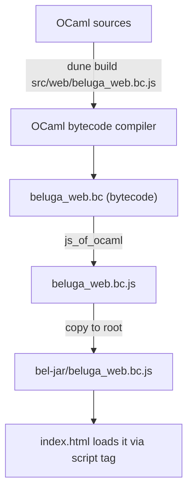
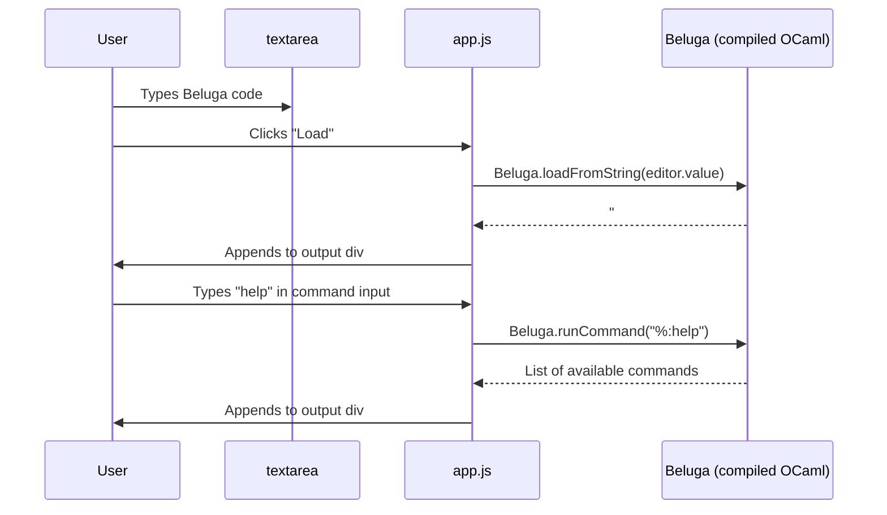

#  BelJar — Beluga IDE

**BelJar** is a modern in-browser IDE for the [Beluga](https://github.com/Beluga-lang/Beluga) logic framework. It uses `js_of_ocaml` to adapt the Beluga compiler into Javasscript, which allows it to run entirely client-side.

It's currently in its beginning stages. In the future, it can be a staging ground for experimental Beluga features.


---

### Key Entry Points

| Function | What it does |
|---|---|
| `Load.load_fresh filename` | Reads `.cfg`/`.bel` from disk, runs full pipeline |
| `Command.create_initial_state ()` | Creates REPL state (used by Harpoon/emacs) |
| `Command.interpret_command state ~input` | Processes a `%:command` in the REPL |
| `Chatter.print lvl f` | Emits compiler diagnostic messages |

### What Breaks on Web

1. **No filesystem** — `Load.load_fresh` opens files via `In_channel`. Browser has no `open_in`.
2. **Hardcoded stdout** — `Chatter.print` writes to `Format.std_formatter`. No way to capture output.
3. **Blocking prompt** — `Logic.ml` calls `read_line()` for "More solutions?" — blocks forever in JS.
4. **`Unix.times()`** — `Monitor.ml` uses this for timing. `js_of_ocaml`'s Unix stub throws.
5. **`Str` library** — `prettyint.ml` uses `Str.regexp`. `Str` has C stubs, incompatible with js_of_ocaml.
6. **Warning 53** — `js_of_ocaml-ppx` generates code that triggers warning 53 ("unused open"), which is a hard error under Beluga's `-warn-error +A` setting.

---

## Every Patch

### 1. Output redirection — `src/core/chatter.ml`

**Problem:** Output goes to stdout. Browser has no stdout.

**Full adapted file:**
```ocaml
open Support

let level : int ref = ref 1

let formatter : Format.formatter ref = ref Format.std_formatter

let set_formatter ppf = formatter := ppf

let print lvl f =
  if lvl <= !level
  then (f !formatter; Format.pp_print_flush !formatter ())
  else ()
```

The original hardcoded `Format.std_formatter`. Now it's a mutable ref — defaults to stdout (CLI unchanged), web swaps it for a `Buffer.t`-backed formatter.

---

### 2. Configurable formatter + string loading — `src/core/command.ml`

**Problem:** `create_initial_state` hardcodes `Format.std_formatter`; no way to load code from a string.

**Key changes** (in a 966-line file):

Line 154 — `ppf` is now a field in `state`:
```ocaml
type state =
  { ppf : Format.formatter
  ; commands : command String.Hashtbl.t
  (* ... rest unchanged ... *)
  }
```

Lines 403–408 — new `load_from_string` in `Make_interpreter_state`:
```ocaml
let load_from_string state ~virtual_filename ~content =
  let sgn =
    Load.load_from_string state.load_state ~virtual_filename ~content
  in
  state.last_load <- Option.none;
  sgn
```

Lines 937–952 — `create_initial_state` now takes optional `ppf`:
```ocaml
let create_initial_state ?(ppf = Format.std_formatter) () =
  Chatter.set_formatter ppf;
  (* ... creates disambiguation/indexing/reconstruction states ... *)
  let state =
    Interpreter_state.create_state ppf disambiguation_state
      indexing_state signature_reconstruction_state
  in
  Interpreter.register_commands state;
  state
```

Lines 964–965 — top-level `load_from_string` delegate:
```ocaml
let load_from_string state ~virtual_filename ~content =
  Interpreter_state.load_from_string state ~virtual_filename ~content
```

---

### 3. Command interface — `src/core/command.mli`

**Full adapted file:**
```ocaml
type state

val fprintf : state -> ('a, Format.formatter, Unit.t) format -> 'a

val create_initial_state : ?ppf:Format.formatter -> Unit.t -> state

val print_usage : state -> Unit.t

val interpret_command : state -> input:String.t -> Unit.t

val load : state -> filename:String.t -> Synint.Sgn.sgn

val load_from_string :
  state -> virtual_filename:String.t -> content:String.t -> Synint.Sgn.sgn
```

Two changes from upstream: `?ppf` parameter on `create_initial_state`, and `load_from_string`.

---

### 4. String-based loading — `src/core/load.ml`

**Problem:** Beluga only loads from disk. We need to load from a raw string.

**Added to `LOAD_STATE` (lines 17–21):**
```ocaml
val read_signature_from_string :
  state ->
  virtual_filename:String.t ->
  content:String.t ->
  Synext.signature_file
```

**Implementation (lines 75–87):**
```ocaml
let read_signature_from_string state ~virtual_filename ~content =
  let signature_file =
    let initial_location = Location.initial virtual_filename in
    let token_sequence = Lexer.lex_string ~initial_location content in
    let parsing_state =
      Parser_state.initial ~initial_location token_sequence
    in
    Parser.Parsing.eval_exn
      Parser.Parsing.(only signature_file)
      parsing_state
  in
  Disambiguation.disambiguate_signature_file state.disambiguation_state
    signature_file
```

This mirrors `read_signature_file` exactly, but uses `Lexer.lex_string` instead of `Lexer.lex_input_channel`. `Lexer.lex_string` already existed in Beluga (used by the REPL) — it was just never wired up for full signature loading.

**`load_from_string` (lines 220–272):** Mirrors `load_file` exactly — same `Gensym.reset`, `Store.clear`, `Typeinfo.clear_all`, `Holes.clear`, same reconstruction + coverage + logic + leftover-var checks. Calls `read_signature_from_string` instead of `read_signature_file`.

**Convenience wrapper (lines 299–312):** `load_from_string_fresh` — creates fresh states, useful for standalone usage.

---

### 5. Load interface — `src/core/load.mli`

Three additions to the interface:

```ocaml
(* In LOAD_STATE *)
val read_signature_from_string :
  state -> virtual_filename:String.t -> content:String.t -> Synext.signature_file

(* In LOAD *)
val load_from_string :
  state -> virtual_filename:String.t -> content:String.t -> Synint.Sgn.sgn

(* Top-level convenience *)
val load_from_string_fresh :
  virtual_filename:string -> content:string -> Synint.Sgn.sgn
```

---

### 6. Safe Unix.times — `src/core/monitor.ml`

**Problem:** `Unix.times()` throws in `js_of_ocaml`.

**Added (lines 25–29):**
```ocaml
let safe_times () =
  try Unix.times ()
  with _ ->
    { Unix.tms_utime = 0.; tms_stime = 0.;
      tms_cutime = 0.; tms_cstime = 0. }
```

All usages of `Unix.times ()` in the file replaced with `safe_times ()`. Monitoring is optional anyway (controlled by `Monitor.on`), so zeroed values are fine.

---

### 7. Configurable prompt — `src/core/logic.ml` + `logic.mli`

**Problem:** `read_line()` blocks the JS event loop forever.

**Added to Options (logic.ml lines 38–43):**
```ocaml
let more_solutions_prompt : (unit -> bool) ref = ref (fun () ->
  Printf.printf "More? ";
  match read_line () with
  | "y" | "Y" | ";" -> true
  | "q" | "Q" -> false
  | _ -> false)
```

**Exposed in logic.mli (line 12):**
```ocaml
module Options : sig
  val enableLogic : bool ref
  val more_solutions_prompt : (unit -> bool) ref
end
```

The default is the original CLI behavior. Web overrides it with `fun () -> false` — "no more solutions."

---

### 8. Remove Str dependency — `src/core/prettyint.ml` + `src/core/dune`

**Problem:** `Str` uses C stubs. js_of_ocaml can't compile C stubs.

**prettyint.ml (lines 126–128):**
```ocaml
(* Was: let ident_regexp = Str.regexp {|[^"].*|} + Str.string_match *)
let is_name_syntactically_valid name =
  let s = Name.string_of_name name in
  String.length s > 0 && s.[0] <> '"'
```

**src/core/dune:** Removed `str` from the `(libraries ...)` list. `str` remains in `src/html/dune` because `beluga_html` is a separate library not linked into the web bundle.

---

### 9. Fix html/dune install stanza — `src/html/dune`

**Added `(package beluga)` to the install stanza:**
```dune
(install
 (package beluga)
 (section share)
 (files beluga.css))
```

Without specifying the package, `dune build` may fail depending on the version.

---

### 10. Web build target — `src/web/dune` (NEW)

```dune
(executable
 (name beluga_web)
 (modes js)
 (libraries
  js_of_ocaml
  support
  beluga
  beluga_syntax
  beluga_parser)
 (js_of_ocaml
  (flags (:standard --disable use-js-string)))
 (flags (:standard -w -53))
 (preprocess
  (pps js_of_ocaml-ppx)))
```

> [!WARNING]
> `--disable use-js-string` is **required**. Without it, js_of_ocaml uses JS native strings, but Beluga's lexer and string handling depend on OCaml byte-sequence semantics. Unicode characters (`⊃`, `∧`, `∨`, `¬`, `⊤`) corrupt without this flag.

> [!NOTE]
> `-w -53` is scoped deliberately to this stanza rather than globally. Warning 53 only fires from `js_of_ocaml-ppx` output — suppressing it globally would mask it legitimately elsewhere in the codebase.

---

### 11. Web entry point — `src/web/beluga_web.ml` (NEW)

**Full file:**
```ocaml
open Js_of_ocaml
open Beluga
open Beluga_syntax.Syncom

type session =
  { state : Command.state
  ; buf : Buffer.t
  ; ppf : Format.formatter
  }

let drain session =
  Format.pp_print_flush session.ppf ();
  let s = Buffer.contents session.buf in
  Buffer.clear session.buf;
  s

let create () =
  let buf = Buffer.create 4096 in
  let ppf = Format.formatter_of_buffer buf in
  Logic.Options.more_solutions_prompt := (fun () -> false);
  Chatter.level := 1;
  let state = Command.create_initial_state ~ppf () in
  { state; buf; ppf }

let load_from_string session content =
  try
    ignore
      (Command.load_from_string session.state ~virtual_filename:"input.bel"
         ~content : Synint.Sgn.sgn);
    drain session
  with e ->
    let bt = Printexc.get_backtrace () in
    let msg =
      try Format.asprintf "%t" (Error.find_printer e)
      with _ -> Printexc.to_string e
    in
    Buffer.clear session.buf;
    msg ^ "\n" ^ bt

let run_command session input =
  try
    Command.interpret_command session.state ~input;
    drain session
  with e ->
    let msg =
      try Format.asprintf "%t" (Error.find_printer e)
      with _ -> Printexc.to_string e
    in
    Buffer.clear session.buf;
    msg

let () =
  Printexc.record_backtrace true;
  let session = ref (create ()) in
  Js.export "Beluga"
    (object%js
       method create =
         session := create ();
         Js.string "Beluga session created."

       method loadFromString content =
         let s = Js.to_string content in
         Js.string (load_from_string !session s)

       method runCommand input =
         let s = Js.to_string input in
         Js.string (run_command !session s)

       method reset =
         session := create ();
         Js.string "Session reset."
    end)
```

This file ties everything together:
1. Creates a `Buffer.t` + `Format.formatter` pair (captures all output)
2. Disables the blocking prompt (`more_solutions_prompt := fun () -> false`)
3. Creates state with `~ppf` (patches 1–3)
4. Exports `Beluga.loadFromString`, `Beluga.runCommand`, `Beluga.reset` to JS
5. Exception handling: uses Beluga's registered printer for human-readable errors, falls back to `Printexc.to_string`

---

## Build Pipeline



Two stages: OCaml compiles to bytecode (`.bc`), then js_of_ocaml translates that bytecode to JavaScript. The `bc` in the filename literally stands for **bytecode**. All Beluga warning/error settings apply during Stage 1 (normal OCaml compilation) — js_of_ocaml only sees the already-compiled bytecode in Stage 2.

The build scripts (`rebuild.ps1` / `rebuild.sh`) just run `dune build` in `Adapted-Beluga` and copy the output to the project root.

---

## Frontend

[index.html](file:///c:/Users/Dean/Documents/Coding/bel-jar/index.html) is a shell that loads [css/style.css](file:///c:/Users/Dean/Documents/Coding/bel-jar/css/style.css) and [js/app.js](file:///c:/Users/Dean/Documents/Coding/bel-jar/js/app.js).

### JS API

```javascript
Beluga.loadFromString(code)   // → string (compiler output)
Beluga.runCommand(cmd)        // → string (command result)
Beluga.reset()                // → string ("Session reset.")
```

### Data Flow



The command input auto-prepends `%:` so users can type `help` instead of `%:help`.

---

## Upstream Reintegration Checklist

When Beluga updates upstream, re-apply these 13 patches in order:

| # | File(s) | Type | Description |
|---|---|---|---|
| 1 | `src/core/chatter.ml` | **Modify** | Add `formatter` ref + `set_formatter` |
| 2 | `src/core/command.ml` | **Modify** | Add `?ppf` to `create_initial_state`, add `load_from_string` |
| 3 | `src/core/command.mli` | **Modify** | Expose `?ppf` + `load_from_string` |
| 4 | `src/core/load.ml` | **Modify** | Add `read_signature_from_string` + `load_from_string` |
| 5 | `src/core/load.mli` | **Modify** | Expose string-loading functions |
| 6 | `src/core/monitor.ml` | **Modify** | Add `safe_times()` wrapper |
| 7 | `src/core/logic.ml` | **Modify** | Add configurable `more_solutions_prompt` |
| 8 | `src/core/logic.mli` | **Modify** | Expose `more_solutions_prompt` |
| 9 | `src/core/prettyint.ml` | **Modify** | Replace `Str` regex with char check |
| 10 | `src/core/dune` | **Modify** | Remove `str` from libraries |
| 11 | `src/html/dune` | **Modify** | Add `(package beluga)` to install stanza |
| 12 | `src/web/dune` | **Create** | js_of_ocaml executable config (includes scoped `-w -53`) |
| 13 | `src/web/beluga_web.ml` | **Create** | JS entry point |

> [!TIP]
> Quickest diff: `diff -rq Beluga/src Adapted-Beluga/src` shows exactly which files diverge.

---

## Design Rationale

| Problem | Root Cause | Solution |
|---|---|---|
| No filesystem | Browser has no `open_in` | Parse from string via `Lexer.lex_string` |
| No stdout capture | `Format.std_formatter` → console | Redirect via `Chatter.set_formatter` to a `Buffer.t` |
| Blocking I/O | `read_line()` halts JS event loop | Configurable function ref, default "no" |
| C stubs | `Unix.times()` + `Str` not in JS | `try/with` fallback + pure OCaml reimplementation |
| Build errors | Warning 53 from ppx codegen | `-w -53` scoped to `src/web/dune` |
| String corruption | JS strings ≠ OCaml byte sequences | `--disable use-js-string` flag |
